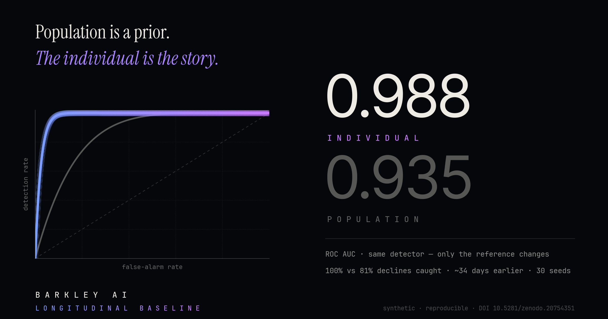

# Barkley AI

> **Intelligence begins where averages end.**

Barkley is an open **behavioral intelligence research platform** developing longitudinal AI models built around **individual baselines** instead of population averages. We are an ethology-driven research lab working on one thesis:

> *"A dog can remain statistically normal for its breed while becoming abnormal for itself."*

---

### 📊 The result that makes the difference

Same detector. Same data. Only the reference frame changes.

| Metric | Individual baseline | Breed average |
|---|---|---|
| **AUC · decline detection** | **0.988** | 0.935 |
| **Declines caught** | **100%** | 81% |
| **Median lead time** | **~34 days earlier** | — |
| **Reproducibility** | 30 seeds · synthetic · DOI-archived | |

→ **Head-to-head Validation v2** — [`barkley-reference-architecture`](https://github.com/labs-barkley/barkley-reference-architecture) · DOI [10.5281/zenodo.20754351](https://doi.org/10.5281/zenodo.20754351)

---
### 🧭 One thesis, three industries

The result above is not about dogs. It is about **measurement**. The same architecture — individual longitudinal baselines instead of population averages — has now been declined into two open sibling protocols, proving the model travels across industries:

- 🟦 **[IREP — Individual-Referential Evaluation Protocol](https://github.com/labs-barkley/irep)** *(hiring & admissions)* — category-blind, trajectory-rich evaluation first; category data firewalled until the decision is final. Not a product: **a commons — free, forever, including for commercial implementers.** Working paper DOI [10.5281/zenodo.21211589](https://doi.org/10.5281/zenodo.21211589) · repository DOI [10.5281/zenodo.21211408](https://doi.org/10.5281/zenodo.21211408) · [irepprotocol.org](https://irepprotocol.org) · [Become IREP →](https://irepprotocol.org/become.html)
- 🎼 **ACTA — Attestation of Creative Trajectory and Authorship** *(music · opening soon)* — IREP's sister protocol: authorship attests at the **gesture**, not the file. Open provenance for human creation in the age of generated everything. Provisional patent INPI FR2609280 (filed July 2026) · DOI [10.5281/zenodo.21230054](https://doi.org/10.5281/zenodo.21230054) · actamusic.org

*A dog is not its breed. A candidate is not their category. A work is not its file. Same failure mode — the wrong reference class — and same fix.*

---

### 📌 Pinned Work

- 🟦 **[irep](https://github.com/labs-barkley/irep)** — the Individual-Referential Evaluation Protocol: the thesis applied to hiring, offered to the commons (working paper DOI [10.5281/zenodo.21211589](https://doi.org/10.5281/zenodo.21211589)) → [Become IREP](https://irepprotocol.org/become.html)
- ⚙️ **[barkley-reference-architecture](https://github.com/labs-barkley/barkley-reference-architecture)** — the open 8-layer stack for individual-referenced behavioral intelligence: individual baselines, temporal binning, CUSUM/BOCPD drift detection, Sovereignty of Silence, DogGraph event schema — plus the reproducible **head-to-head validation** (v0.2.0, DOI [10.5281/zenodo.20754351](https://doi.org/10.5281/zenodo.20754351)).
- 🧪 **[barkley-canine-cognition-lab](https://github.com/labs-barkley/barkley-canine-cognition-lab)** — public research demonstrator. Individual baseline modeling, temporal drift detection, and the Missing Data Paradox, on synthetic data (DOI [10.5281/zenodo.20059956](https://doi.org/10.5281/zenodo.20059956)).
- 🐕 **[Synthetic DogGraph Sample](https://huggingface.co/datasets/labs-barkley/synthetic-doggraph-sample)** — open longitudinal canine behavioral dataset on Hugging Face · CC BY-NC 4.0.
- 🔎 **[Drift Explorer](https://drift-explorer.getbarkley.com/)** *(live)* — switch the reference frame and watch the same data change meaning.
- 🕸 **[DogGraph Demo](https://barkley-doggraph.streamlit.app/)** *(live)* — schema-constrained GraphRAG over the behavioral memory layer, read-only Cypher.
- 🌐 **[getbarkley.com](https://getbarkley.com)** — the research platform: thesis, evidence, benchmark, publications, waitlist.

---

### 📄 Publications

- **The Reference-Class Trap in Animal-Computer Interaction: Toward Individual Longitudinal Baselines in Companion-Animal Behavioral Monitoring** — working paper, DOI [10.5281/zenodo.20756552](https://doi.org/10.5281/zenodo.20756552). Breed explains only ~9% of behavioral variation in dogs; each animal should be its own control.
- **The Individual-Referential Evaluation Protocol (IREP): An Open Standard for Category-Blind, Trajectory-Rich Assessment in Hiring and Admissions** — working paper, DOI [10.5281/zenodo.21211589](https://doi.org/10.5281/zenodo.21211589) · [irepprotocol.org](https://irepprotocol.org)
- **Precision Behavioral Intelligence Series (No. 01–08)** and **Metabolic Series (No. 01)** — 11 DOI-archived framework papers → [ORCID 0009-0004-6031-659X](https://orcid.org/0009-0004-6031-659X)
- **Your Model Doesn't Have a Bias Problem. It Has a Reference Class Problem.** — featured analysis, [DataDrivenInvestor](https://datadriveninvestor.com/articles/your-model-doesn-t-have-a-bias-problem-it-has-a-reference-class-problem)
- **The Normative Trap: Temporal Identity and the Failure of Population Intelligence** — founder's manifesto (book), DOI [10.5281/zenodo.20516821](https://doi.org/10.5281/zenodo.20516821) · [books2read.com/normative-trap](https://books2read.com/normative-trap)

4 patent applications pending — Barkley: INPI France · PCT international · ACTA: INPI FR2609280 (July 2026).

---

### 🛠 Technical Pillars

- **Individual-Centric Modeling** — moving from *"Is this dog normal?"* to *"Is this dog still this dog?"*
- **DogGraph Architecture** — a temporal, graph-based approach to behavioral phenotyping
- **Informative Absence Signaling** — encoding the *silence* in data as a behavioral feature, not a technical failure
- **Metabolic Fusion** — integrating non-invasive metabolic monitoring with circadian behavioral bins

---

### 📚 Research & Ethics

Our framework is built on:

- **Ethological rigor** — rooted in Tinbergen's Four Questions
- **Algorithmic fairness** — a commitment to individual cognitive sovereignty over breed stereotypes
- **Open science** — DOI-archived papers, open dataset, source-available reference architecture, canonical [glossary](https://getbarkley.com/llms.txt)
- **Safe execution** — all public demonstrators use synthetic data to protect privacy and ensure research integrity

---

### 🤝 Collaboration

We are in a high-execution phase and looking to connect with:

- **Technical co-founders** — engineers passionate about graph architecture, time-series analysis, and biosensor integration
- **Strategic research partners** — academic labs, veterinary networks, and longitudinal cohort studies interested in individual-centric behavioral phenotyping

---

### 📬 Contact

| | |
|---|---|
| 📊 **Investor / strategic** | [invest@getbarkley.com](mailto:invest@getbarkley.com) |
| 🔬 **Research / lab** | [labs@getbarkley.com](mailto:labs@getbarkley.com) |
| ✉️ **Corresponding author** | [elodie@getbarkley.com](mailto:elodie@getbarkley.com) |
| 🤲 **IREP commons** | [commons@irepprotocol.org](mailto:commons@irepprotocol.org) |
| 🌐 **Web** | [getbarkley.com](https://getbarkley.com) |
| 📑 **ORCID** | [0009-0004-6031-659X](https://orcid.org/0009-0004-6031-659X) |
| 🐦 **X** | [@getbarkley](https://x.com/getbarkley) |

---

*Barkley is a research prototype. All public demonstrators use synthetic data. We do not provide veterinary or medical diagnosis.*
