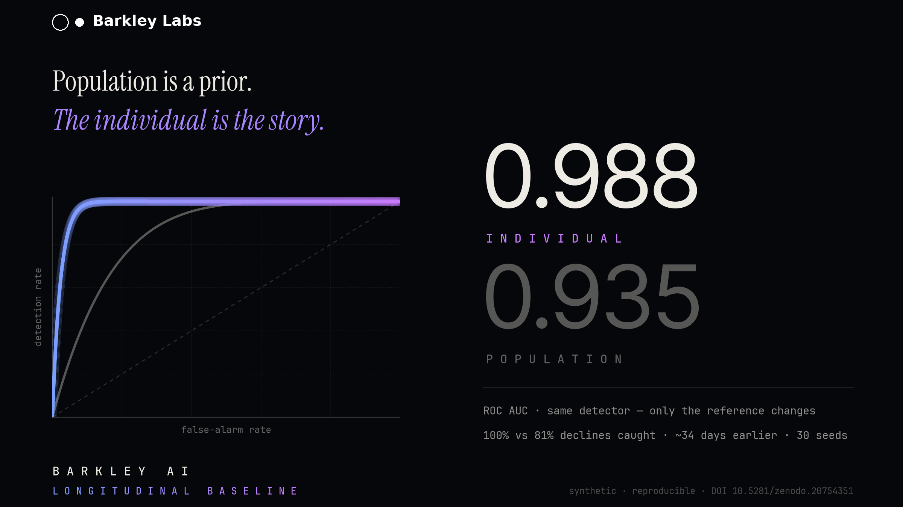
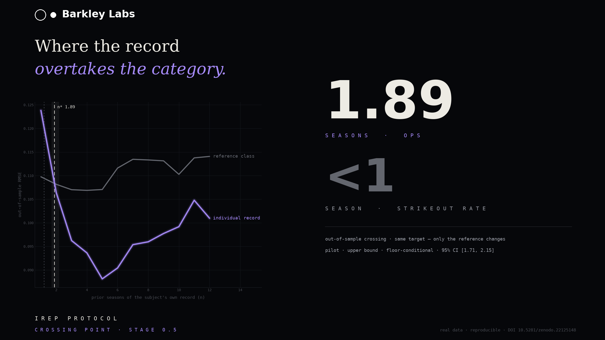

# Barkley Labs

**The systems lab for individual intelligence.**

Most systems begin with the population and infer the individual. Barkley Labs builds architectures that begin with one — and keep its evidence intact before anyone interprets it.

> **A dog is not its breed. A person is not their category. A work is not its output.**
> Same failure mode — the wrong reference class — and the same fix.

[barkleylabs.ai](https://barkleylabs.ai) · [lab@barkleylabs.ai](mailto:lab@barkleylabs.ai)

---

## The thesis, tested in two domains

Same detector. Same synthetic data. Only the reference frame changes.

| Metric | Individual baseline | Population average |
|---|---|---|
| **AUC · decline detection** | **0.988** | 0.935 |
| **Declines caught** | **100%** | 81% |
| **Median lead time** | **~34 days earlier** | — |
| **Reproducibility** | 30 seeds · synthetic data · DOI-archived | |

Head-to-head validation v2.0 — [`barkley-reference-architecture`](https://github.com/labs-barkley/barkley-reference-architecture) · DOI [10.5281/zenodo.20754351](https://doi.org/10.5281/zenodo.20754351)

This benchmark tests the architecture **in the behavioral domain only**, on synthetic data. Since August 2026 the premise also has a **real-data** measurement, in a second domain:

[**The Crossing Point**](https://github.com/labs-barkley/irep-crossing-point) · DOI [10.5281/zenodo.22125148](https://doi.org/10.5281/zenodo.22125148) — Stage 0.5 of the IREP validation plan measures where an individual's own record overtakes their reference class, out of sample, on 69 seasons of the Lahman Baseball Database: 1.89 prior seasons for a slow composite metric (95% CI [1.71, 2.15]), below one season for a stable skill. Pilot, hypothesis-generating, with its conditions attached; a different task (prediction, real data) from the benchmark above (detection, synthetic). ACTA Music carries its own evidence, listed below.

---

## Three systems. One architectural decision.

| System | Domain | The question it answers | Status |
|---|---|---|---|
| **Barkley AI™** · [getbarkley.com](https://getbarkley.com) | Behavioral intelligence | *Is this individual still itself?* | Research platform · reproducible benchmark · live demonstrators |
| **IREP Protocol** · [irepprotocol.org](https://irepprotocol.org) | Evaluation & fairness | *Are we evaluating the individual, or their category?* | v0.1 open for public comment · premise measured on real data ([Stage 0.5 pilot](https://github.com/labs-barkley/irep-crossing-point)) · specification CC BY 4.0 · a commons, free forever |
| **ACTA Music™** · [actamusic.org](https://actamusic.org) | Creative provenance | *Can authorship be evidenced before the final output exists?* | Working paper public · specification and reference implementation in private pre-release |

**The method — the same four steps, in the same order:**

**Observe** one individual, over time → **Preserve** what happened, in order, signed where it matters → **Compare** against that individual's own evidence, history or trajectory → **Decide**, by a human, with the evidence and the trace of how it was produced.

Inference is useful. Evidence comes first.

---

## Public repositories

- **[irep](https://github.com/labs-barkley/irep)** — the Individual-Referential Evaluation Protocol: specification, validation plan, starter kit and runnable Stage 0 demonstration. Specification CC BY 4.0, demonstration code Apache-2.0. Paper DOI [10.5281/zenodo.21211589](https://doi.org/10.5281/zenodo.21211589) · repository DOI [10.5281/zenodo.21211408](https://doi.org/10.5281/zenodo.21211408) · [Become IREP →](https://irepprotocol.org/become.html)
- **[barkley-reference-architecture](https://github.com/labs-barkley/barkley-reference-architecture)** — the 8-layer stack for individual-referenced behavioral intelligence: individual baselines, temporal layer, drift engine, silence layer, reference class, behavioral replay, head-to-head and synthetic validation. Python, source-available research license (free for research, education and evaluation). DOI [10.5281/zenodo.20754351](https://doi.org/10.5281/zenodo.20754351)
- **[barkley-canine-cognition-lab](https://github.com/labs-barkley/barkley-canine-cognition-lab)** — research demonstrator: individual baseline modeling, temporal drift detection and the Missing Data Paradox, on synthetic data. DOI [10.5281/zenodo.20059956](https://doi.org/10.5281/zenodo.20059956)

**ACTA Music — private repository.** The specification and reference implementation (session trees, longitudinal registry, RFC 3161 anchoring, C2PA embedding, 97 automated tests) are built and running, and held in private pre-release under patent pending. Evaluation and demo access on request, under written terms: [hello@actamusic.org](mailto:hello@actamusic.org)

## Live demonstrators

- **[Drift Explorer](https://drift-explorer.getbarkley.com/)** — switch the reference frame and watch the same data change meaning.
- **[DogGraph](https://doggraph.getbarkley.com/)** — schema-constrained GraphRAG over the behavioral memory layer, read-only Cypher.
- **[Synthetic DogGraph Sample](https://huggingface.co/datasets/labs-barkley/synthetic-doggraph-sample)** — longitudinal canine behavioral dataset on Hugging Face, CC BY-NC 4.0.

---

## Research

- **ACTA (Attestation of Creative Trajectory and Authorship): an individual-referential, artist-held provenance protocol for music composition** — working paper v0.1, CC BY 4.0. DOI [10.5281/zenodo.21230054](https://doi.org/10.5281/zenodo.21230054)
- **The Individual-Referential Evaluation Protocol (IREP): An Open Standard for Category-Blind, Trajectory-Rich Assessment in Hiring and Admission** — working paper, CC BY 4.0. DOI [10.5281/zenodo.21211589](https://doi.org/10.5281/zenodo.21211589)
- **The Reference-Class Trap in Animal-Computer Interaction: Toward Individual Longitudinal Baselines in Companion-Animal Behavioral Monitoring** — working paper. Breed explains only ~9% of behavioral variation; each animal should be its own control. DOI [10.5281/zenodo.20756552](https://doi.org/10.5281/zenodo.20756552)
- **From Surveillance to Cognition: A Unified Framework for Precision Behavioral and Metabolic Intelligence in Companion Animals** — framework paper. DOI [10.5281/zenodo.20060327](https://doi.org/10.5281/zenodo.20060327)
- **The Normative Trap: Temporal Identity and the Failure of Population Intelligence** — the founder's manifesto. DOI [10.5281/zenodo.20516821](https://doi.org/10.5281/zenodo.20516821) · [books2read.com/normative-trap](https://books2read.com/normative-trap)
- **Precision Behavioral Intelligence Series (No. 01–08)** and **Metabolic Series (No. 01)** — 11 DOI-archived framework papers → [ORCID 0009-0004-6031-659X](https://orcid.org/0009-0004-6031-659X)
- **Your Model Doesn't Have a Bias Problem. It Has a Reference Class Problem.** — featured analysis, [DataDrivenInvestor](https://datadriveninvestor.com/articles/your-model-doesn-t-have-a-bias-problem-it-has-a-reference-class-problem)

Canonical definitions and machine-readable entity card: [barkleylabs.ai/llms.txt](https://barkleylabs.ai/llms.txt) · research feed: [barkleylabs.ai/feed.xml](https://barkleylabs.ai/feed.xml)

---

## Founder

**Elodie Aishwarya Remoissenet** — Founder & Protocol Architect.
ORCID [0009-0004-6031-659X](https://orcid.org/0009-0004-6031-659X)

---

## Collaborate with Barkley Labs

- **Technical partners** — engineers working on graph architecture, longitudinal time series, cryptographic attestation and biosensor integration.
- **Research partners** — academic labs, veterinary networks and longitudinal cohort studies interested in individual-referential phenotyping.
- **Implementers** — hiring and admissions teams adopting the IREP Protocol; artists, labels and platforms evaluating ACTA Music.

| | |
|---|---|
| **The lab** | [lab@barkleylabs.ai](mailto:lab@barkleylabs.ai) |
| **Barkley AI — research & technical** | [labs@getbarkley.com](mailto:labs@getbarkley.com) |
| **ACTA Music — evaluation & demo access** | [hello@actamusic.org](mailto:hello@actamusic.org) |
| **IREP commons** | [commons@irepprotocol.org](mailto:commons@irepprotocol.org) |
| **Investors & strategic** | [invest@getbarkley.com](mailto:invest@getbarkley.com) |
| **Web** | [barkleylabs.ai](https://barkleylabs.ai) · [Hugging Face](https://huggingface.co/labs-barkley) |

---

## IP & legal

**Patent applications filed — patent pending.** Barkley AI™: **FR2605477** · **FR2605026**. ACTA Music™: **FR2609502** · **FR2609280** — disclosure and exploitation authorized by the INPI; filed to keep ACTA's mechanisms from enclosure.

**Trademarks.** Barkley AI™ and ACTA Music™ are trademarks of Barkley Labs. The IREP Protocol is open and published by Barkley Labs.

**Licenses.** IREP Protocol: specification CC BY 4.0, demonstration code Apache-2.0. ACTA Music: working paper CC BY 4.0; specification and reference implementation in private pre-release. Barkley reference architecture and demonstrators: source-available research license (research, education and evaluation), synthetic data only.

**Scope.** Barkley Labs systems assist human decisions. None of them makes a legal determination, an AI-detection verdict or an autonomous selection decision. All public demonstrators use synthetic data; we do not provide veterinary or medical diagnosis.

---

**We build for n = 1.**
Evidence before inference. The individual is the reference.
